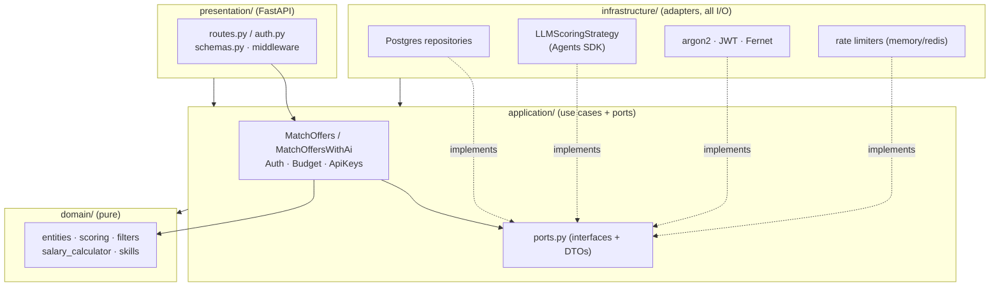
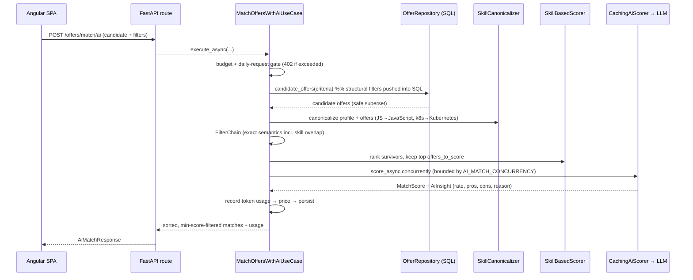

# Job Offers Evaluator — Project Documentation

> This folder is an independent **technical documentation & assessment package** produced by
> reviewing the repository directly (source, tests, migrations, CI, Docker, frontend). It is
> written to (a) explain the project, (b) present it well on GitHub, and (c) support an objective
> evaluation of the author's engineering level for Python roles.
>
> Contents: **[README](README.md)** · **[PROS_AND_CONS](PROS_AND_CONS.md)** ·
> **[EVALUATION](EVALUATION.md)** · **[ADDITIONAL](ADDITIONAL.md)**
>
> The project's own root `README.md` is excellent and remains the canonical operational map; this
> document summarises and reframes it for review purposes and adds an architectural walk-through.

---

## 1. Purpose — what the project is

**Job Offers Evaluator** is a multi-tenant web application that matches **job offers** to a
**candidate's profile** and, optionally, scores the fit with an LLM (OpenAI or Google Gemini). Each
user maintains their own profile (summary, rated skills, projects, experience), brings their own
provider API key, and gets ranked, explained matches plus a Polish net-salary calculator.

It is deliberately split into two independent processes that talk over HTTP:

| Tier | Technology | Role |
|---|---|---|
| **Backend** | Python 3.13 · FastAPI · PostgreSQL | JSON API, matching engine, auth, billing/cost control |
| **Frontend** | Angular 22 · Angular Material | Standalone SPA; cookie-session client of the API |

The **offers** themselves are produced by a *separate*, external offers source; this app treats the
`offers` / `salaries` / `normalized_salary` tables as **read-only** and ships a seed script (~50
diverse demo offers) so the whole thing runs with no external source and no API keys.

### Two matching modes

1. **Deterministic** (`/offers/match`) — fast, no I/O. A rating- and evidence-weighted tech-stack
   overlap score.
2. **AI-scored** (`/offers/match/ai`) — the deterministic score (weight 4) blended with an
   LLM-rated description fit (weight 1), returning pros/cons and a rationale per offer, scored
   concurrently and gated by per-user budgets.

---

## 2. Quickstart

The fastest path (from the project root, **not** this folder). Browsing offers, deterministic
matching and the salary calculator need **no API keys**; AI matching uses a per-user key added
later in the UI.

### A. Docker (recommended)

```bash
cp .env.example .env              # defaults work as-is for the demo
docker compose up -d --build      # Postgres + API (migrations run on boot)
docker compose run --rm seed      # load ~50 demo offers (idempotent)
```

* API + interactive docs → <http://localhost:8000/docs>
* Frontend → `npm --prefix frontend install && npm --prefix frontend start` → <http://localhost:4200>

### B. Local (Postgres in Docker, app on host)

Requires Python 3.13, [uv](https://docs.astral.sh/uv/), Node.js, Docker.

```bash
uv sync                                     # backend deps
cp .env.example .env                        # set APP_ENV=development for local dev
docker compose up -d db                     # just Postgres
uv run alembic upgrade head                 # create app-owned tables
uv run python -m app.scripts.seed_offers    # load demo offers
uv run python main.py                       # API → http://localhost:8000/docs
```

> ⚠️ `APP_ENV` defaults to **`production`** (secure-by-default): it refuses to boot with the
> committed dev secrets. For local dev set `APP_ENV=development` in `.env` (the Docker path does
> this for you). This "fail-closed" default is a deliberate security choice — see [EVALUATION](EVALUATION.md).

### Everyday commands

```bash
uv run pytest                 # backend tests (865 unit+api pass in ~11s; integration self-skips w/o DB)
uv run ruff check             # lint (clean)
uv run mypy                   # type-check (clean, 111 files)
npm --prefix frontend test    # frontend tests (Vitest)
npm --prefix frontend run build
```

---

## 3. Tech stack

| Area | Choices |
|---|---|
| **Language** | Python 3.13, TypeScript 6 |
| **Backend framework** | FastAPI 0.137 + Uvicorn; Pydantic v2 schemas |
| **Persistence** | PostgreSQL, SQLAlchemy 2.x, psycopg 3, **Alembic** migrations (20) |
| **LLM** | OpenAI **Agents SDK** (`openai-agents`); OpenAI **and** Google Gemini models |
| **Auth / crypto** | PyJWT (HS256 access + rotating refresh), argon2-cffi, `cryptography` (Fernet at-rest key encryption), email-validator |
| **Package / build** | `uv` (backend), `npm`/Angular CLI (frontend) |
| **Quality gates** | ruff (lint+format), mypy, pytest (+pytest-cov), Vitest 4, pip-audit |
| **Frontend** | Angular 22 standalone components + signals, Angular Material 22, RxJS |
| **Runtime infra** | Docker + docker-compose (Postgres, API, seed), optional Redis (shared rate-limiter) |
| **Observability** | stdlib logging → structured JSON, per-request correlation id, readiness probe |

### Scale (measured)

| Area | Files | Lines |
|---|--:|--:|
| Backend `app/` | 110 | ~9,970 |
| — `domain/` (pure) | 14 | ~1,160 |
| — `application/` (use cases + ports) | 16 | ~2,270 |
| — `infrastructure/` (adapters) | 60 | ~3,620 |
| — `presentation/` (FastAPI) | 8 | ~1,830 |
| — `scripts/` (seed, indexers, tooling) | 6 | ~700 |
| `main.py` (composition root) | 1 | 748 |
| **Backend tests** | 103 | ~14,210 |
| Frontend (TS / HTML / SCSS) | 81 | ~9,340 |
| Migrations | 20 | ~760 |

Backend **test-to-code ratio ≈ 1.3 : 1**. Frontend has 9 spec files (~1,380 lines).

---

## 4. Architecture

The backend follows **Clean / Hexagonal Architecture** with a strictly enforced dependency rule:
dependencies point **inward only**. The domain has zero knowledge of FastAPI, SQLAlchemy, or the
LLM SDKs. Every external capability is a **port** (abstract interface) with concrete **adapters**
in `infrastructure`, wired in a single composition root (`main.py`) via FastAPI
`dependency_overrides`.



**Invariants (verified against the code):**

- `domain` imports nothing framework-specific — only `dataclasses`, `abc`, stdlib.
- `application` depends only on `domain` (ports declared here + in domain).
- `presentation` and `infrastructure` depend on `application`; never the reverse.
- `main.py` is the *only* module that knows every concrete type.
- Tests swap the same ports for in-memory fakes (`tests/fakes.py`), so units run with no I/O.

### Design patterns in use

| Pattern | Where |
|---|---|
| **Ports & Adapters (Hexagonal)** | `application/ports.py` + `infrastructure/*` |
| **Strategy** | `salary_calculator` (employment/civil/B2B), `OfferScorer` (skill vs LLM) |
| **Composite** | `FilterChain` composes `OfferFilter`s (ANDed) |
| **Decorator** | `CachingAiScorer` wraps `LLMScoringStrategy`; `PricingModelUsageRepository` wraps the raw repo |
| **Dependency Injection (by override)** | routers declare `get_*` providers raising `NotImplementedError`; `main.py`/tests override |
| **Repository** | one per aggregate (`Postgres*Repository`) |
| **Value objects / frozen dataclasses** | `Skill`, `Offer`, `MatchScore`, `CanonicalSkill`, … |

---

## 5. Core workflow — how a match runs



**Key properties:**

- **SQL push-down:** structural filters (location, net-salary floor, level, expired) run in the
  database via `OfferRepository.candidate_offers`, so the full table is never materialised. The
  domain `FilterChain` then applies exact semantics (including candidate skill overlap) on the
  in-memory superset.
- **Skill canonicalization at the boundary:** raw tokens are collapsed to canonical concepts
  (alias map + case/diacritic/separator folding) on scoring-only copies, so `JS`/`JavaScript`,
  `k8s`/`Kubernetes` and PL/EN variants match — while the original strings stay intact for display.
- **Evidence-aware scoring:** a skill *used in a real project/experience* outweighs a bare
  self-rating; an un-evidenced high self-claim is capped (`UNEVIDENCED_SELF_RATING_CAP`), which
  blunts junior over-claiming.
- **Async, bounded, best-effort AI:** offers are scored concurrently on the event loop; a single
  failed offer is dropped, but if *all* fail the error surfaces. Retries honour a provider
  `Retry-After`, and a Gemini `limit: 0` (retired free-tier model) is detected and reported instead
  of being retried forever.
- **Cost control:** USD budgets (per-user token accounting + an org-spend backstop on an OpenAI
  admin key) for dollar-priced providers, and a per-day **request** budget for the Gemini free
  tier. Exceeding either → HTTP 402.

---

## 6. Main features

- **Two matching modes** — deterministic skill-overlap and LLM-scored fit with explanations.
- **Multi-tenant, bring-your-own-key** — per-user profile, model selection, usage, budgets;
  provider keys encrypted at rest (Fernet), validated against the provider before storing.
- **Production-grade auth** — email-confirmed registration, argon2 hashing, httpOnly JWT access
  cookie + rotating refresh tokens with **reuse detection** (RFC 9700), double-submit CSRF, login
  brute-force throttle, instant revocation via `token_version`.
- **Cost & rate-limit guardrails** — USD budgets, org-spend backstop, Gemini per-day request caps,
  client-side RPM pacing per (user, model).
- **Skill canonicalization** — alias map + folding, an `offer_skill` SQL index for concept-based
  browse filtering, and an offline curation pipeline (corpus mining + embedding-assisted alias
  suggestions) that grows the map from real data.
- **Polish net-salary calculator** — 2026 tax/ZUS rules for B2B (ryczałt/liniowy/skala + ZUS
  schemes), employment, and civil contracts, including youth relief and student exemptions.
- **Observability & 12-factor** — structured JSON logs with per-request correlation ids, a
  `/health/ready` readiness probe, tunable connection pool, graceful DB-down behaviour.
- **Zero-config demo** — `docker compose up` + seed data; no API keys needed to explore.

---

## 7. API surface (selected)

~40 JSON endpoints. Auth = session cookie; state-changing methods also require `X-CSRF-Token`.

| Method | Path | Description |
|---|---|---|
| GET | `/health` · `/health/ready` | Liveness (dependency-free) · readiness (`SELECT 1` → 503 when DB down) |
| POST | `/auth/register` · `/auth/login` · `/auth/refresh` · … | Email-confirmed auth with rotating refresh tokens |
| POST/GET | `/profile` | Save / fetch the caller's profile |
| GET | `/offers` | Browse (paged, filtered by location/salary/tech/level/search/sort) |
| POST | `/offers/match` | Deterministic match |
| POST | `/offers/match/ai` | LLM-scored match (402 budget, 503 AI unavailable) |
| POST | `/salary/calculate` | Polish net take-home for a gross + contract type |
| GET/PUT | `/config/model(s)` | List / select the caller's scoring model |
| GET/PUT/POST | `/usage/*` | Budget spend, limits, daily-request budget, org spend/usage |
| CRUD | `/api-keys` · `/admin-key` | Per-user provider keys + OpenAI admin key |

Full interactive reference at `/docs` (Swagger UI). The complete table lives in the root `README.md`.

---

## 8. Data model

**App-owned** (migrated by Alembic; per-user tables carry a `user_id` FK, `ON DELETE CASCADE`):
`users`, `user_profile`, `selected_model`, `model_usage`, `budget`, `ai_score` (global
content-addressed cache), `refresh_tokens` (SHA-256 hashes only), `user_api_key` (Fernet
ciphertext), `openai_admin_key`, `offer_skill` (+ `offer_skill_index_meta`), `unknown_skill_token`.

**Externally-owned, read-only** (never migrated here): `offers`, `salaries`, `normalized_salary`.

Alembic is the single source of truth for the app schema (`create_all` was intentionally removed so
the app can start and serve `/health` even when the DB is temporarily down).

---

## 9. Repository layout

```
.
├── app/
│   ├── domain/           # pure entities, value objects, ports, algorithms (no frameworks)
│   ├── application/      # use cases + ports (orchestration; depends only on domain)
│   ├── infrastructure/   # adapters: Postgres, LLM, crypto, email, rate limiting (all I/O)
│   ├── presentation/api/ # FastAPI routes, schemas, middleware, error handlers
│   ├── observability/    # structured logging + request-id contextvar
│   ├── scripts/          # seed_offers, index_offer_skills, mine/suggest skill aliases, verify_link
│   ├── config.py         # env → module constants (documented per var)
│   └── config_validation.py  # fail-fast prod config checks
├── main.py               # composition root: builds adapters, wires DI
├── alembic/versions/     # 20 migrations (0001–0020)
├── tests/{unit,integration,api}/ + fakes.py
├── frontend/             # Angular 22 SPA
├── docs/                 # design reports (skills normalization, polish net salary)
├── docker-compose.yml · Dockerfile · .github/workflows/ci.yml
└── README.md · CLAUDE.md · pyproject.toml
```

---

## 10. Frontend

Standalone Angular 22 SPA (`frontend/`), a pure HTTP client of the API (cookies, no shared
process). Modern idioms throughout: **standalone components**, **signals**, **OnPush** change
detection, reactive forms with validators, an **auth interceptor** that adds credentials + CSRF and
transparently refreshes on 401 (single shared refresh, retry once, else redirect to login), and
root-scoped **state services** so results survive navigation. Features: auth suite
(login/register/verify/forgot/reset/change-password), profile editor, deterministic match, AI
match, offer browser, and the model-usage/api-keys/admin-key/daily-requests billing pages.

---

## 11. Verification status (as reviewed)

| Check | Result |
|---|---|
| `uv run pytest tests/unit tests/api -q` | ✅ **865 passed** in ~11s |
| `uv run ruff check` | ✅ All checks passed |
| `uv run mypy` | ✅ No issues in 111 source files |
| Integration tests | Self-skip without a reachable Postgres (by design) |
| CI (`.github/workflows/ci.yml`) | `uv sync` → ruff → mypy → pytest → pip-audit (advisory) on every push/PR |

See **[EVALUATION.md](EVALUATION.md)** for the graded assessment and **[PROS_AND_CONS.md](PROS_AND_CONS.md)**
for the strengths/weaknesses breakdown.
